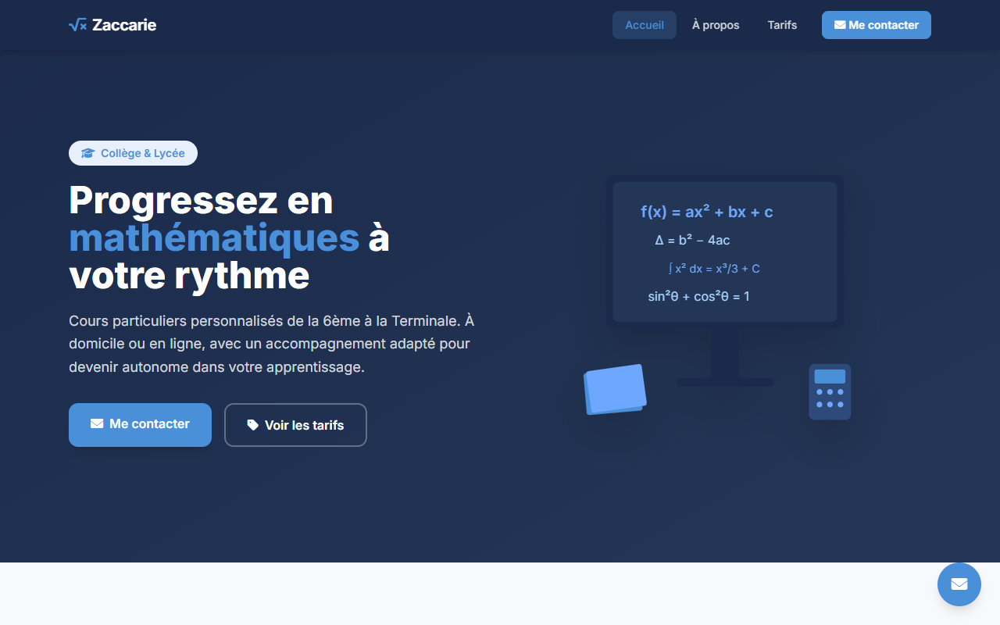
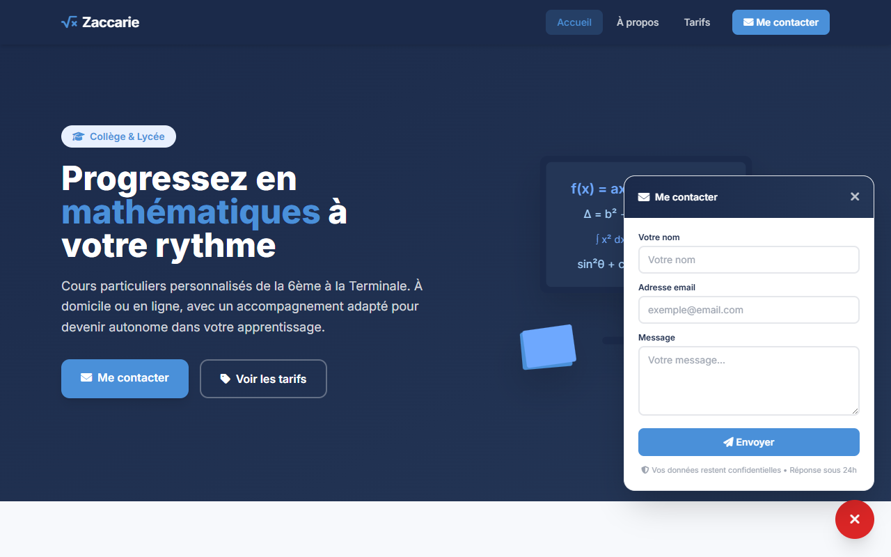

Tutorat Maths
=============

Site vitrine pour des cours particuliers de mathématiques, du collège au lycée.

Tout tient sur une seule page : la présentation du professeur, sa méthode, les niveaux accompagnés de la 6ème à la Terminale, et le tarif. Une FAQ répond aux questions courantes.

Un bouton flottant ouvre un formulaire de contact depuis n'importe quel endroit de la page. Le message est enregistré en base, puis envoyé par email au professeur.

